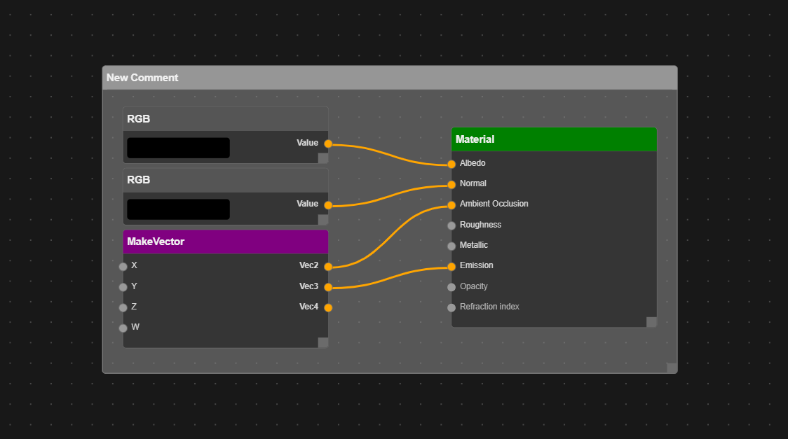
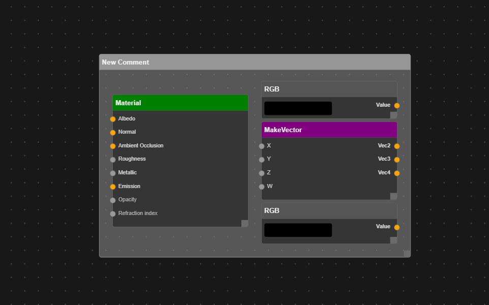

## Motivation

Replacement for current Projection engine shader editor graph which is built using HTML and SVG.
Due to scalability and flexibility problems this will probably be the

**THIS ONLY WORKS ON CHROME**

